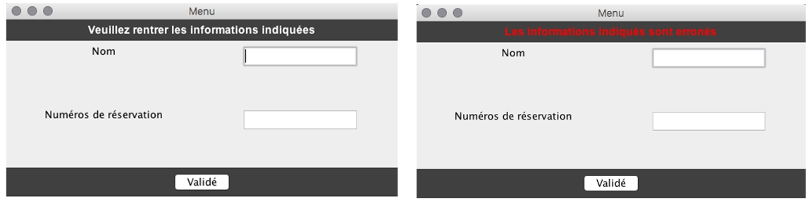
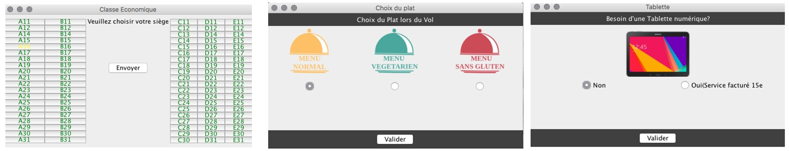
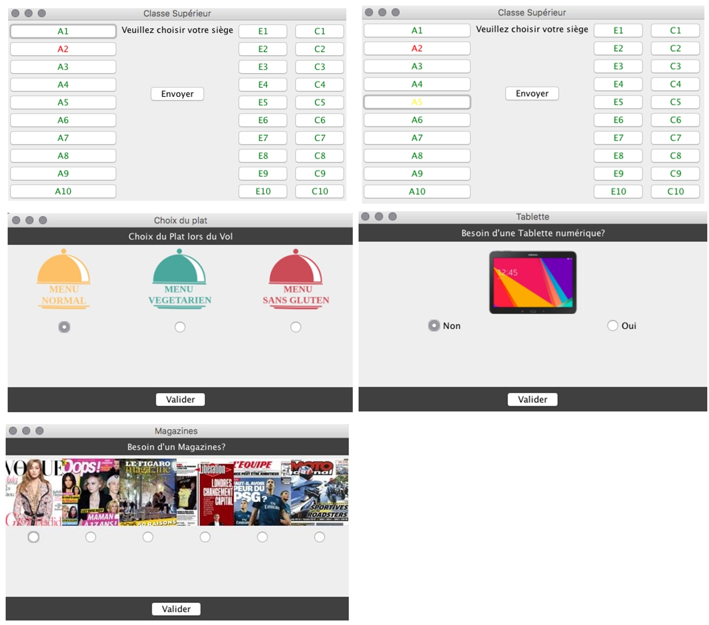
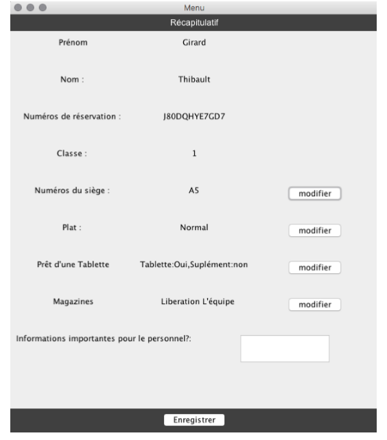

> Projet en Java - DUT Informatique 2017

### Commande pour lancer l'application :

```
 java Starter
 ```


## Résevation de billets d'avion
```
L’objectif de se micro-projet IHM, consiste à créer un système de réservation pour la compagnie Crash Airlines.
Le système de réservation est composé de deux fonctionnalités, celle du client et celle du personnel.
Pour la première fonctionnalité, lorsque le client effectue une réservation, cette compagnie propose deux classes, économique et supérieure.
Ainsi que plusieurs services :
  - Le choix d’un menu : normal, végétarien ou sans gluten
  - Le prêt d’une tablette, service payant pour la classe économique
  - Saisir un commentaire destiné aux personnels de cabine
  - Le choix d’un ou plusieurs magazines pour le client choisissant la classe supérieure
  - La modification du siège et des services

Pour la deuxième fonctionnalité le personnel utilise une table lui affichant :
  - Le plan de la cabine avec le nom de chaque client
  - La liste des menus demandés
  - La liste des tablettes à mettre à disposition
  - La liste des magazines à répartir - La possibilité de modifier le siège et le menu du client.
```








